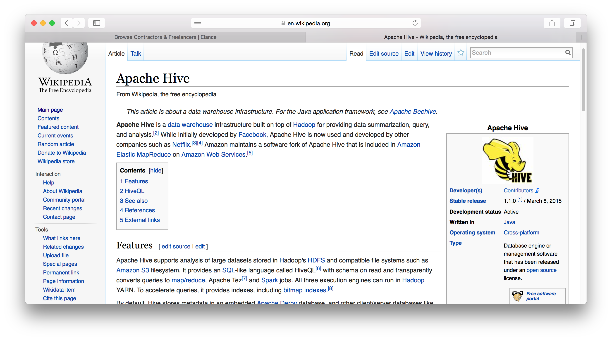

# IT-programming-skills
The shortest description of IT &amp; Programming skills

# Preface
The IT & Programming skill set are __not__ created ourself. Instead we just copy the well defined source and sorted skills from Elance website. See [https://www.elance.com/skills](https://www.elance.com/skills). Most of us might not master all of IT & Programming skills as far as we know, however we could have your own choice. before I try to learn something new, i will always ask myself these questions

* What's this? (tell me the reason why i need your technology)
* How does author optimaze their powerful technology?

## AJAX

## Apache Hive

